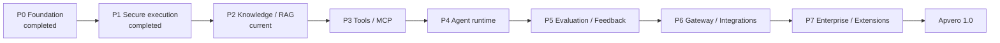

# Apvero delivery roadmap

## Purpose

This roadmap defines implementation order, not marketing dates. Each stage must close a usable end-to-end workflow before the next stage becomes live. Later-stage pages may remain rich prototypes, but they cannot claim server-confirmed behavior early.

The machine-readable authority is [`architecture/delivery-stages.yaml`](../../architecture/delivery-stages.yaml).

## Master flow



| Stage | Outcome | Status |
|---|---|---|
| P0 | Enforceable architecture and runnable repository baseline | Completed |
| P1 | Safe, attributable and cost-controlled model execution | Completed |
| P2 | Immutable tenant-isolated knowledge with cited RAG answers | In progress |
| P3 | Typed and permissioned Tool/MCP execution | Planned |
| P4 | Bounded, observable Agent Application runtime | Planned |
| P5 | Evidence-driven evaluation, feedback and release gates | Planned |
| P6 | Governed Application Gateway and reliable integrations | Planned |
| P7 | Enterprise administration and isolated extension ecosystem | Planned |

## P0 — Foundation and product constitution

Delivered:

- modular-monolith boundaries and architecture tests;
- Application → immutable ReleaseBundle → Run spine;
- PostgreSQL-only default stateful baseline and Docker Compose;
- approved navigation, page inventory and labeled data modes;
- English source locale with required Simplified Chinese coverage;
- OpenAPI, JSON Schemas, ADRs and the AI development constitution;
- public GitHub baseline with green CI.

P0 is closed. Changes to its protected decisions require an ADR rather than reopening the stage informally.

## P1 — Secure model execution and governance

Workflow:

```text
Secret Reference -> Provider -> Model -> Route -> Prompt Version
-> Application Draft -> Preview -> Immutable Release -> Run -> Usage & Cost
```

Delivered: scoped API credentials, Secret References, versioned providers/models/routes/prompts, Application draft binding, immutable preview and production bundles, deterministic and opt-in Spring AI execution, pre-call rate and budget admission, typed audit, non-billable readiness, Micrometer metrics, configurable retention/masking, PostgreSQL isolation/failure verification, run ledger and live usage/cost evidence.

P1 was accepted and closed before P2 became current. Its controls remain mandatory dependencies for every billable P2 embedding and generation call.

Exit: unauthorized, cross-workspace, over-limit and over-budget calls fail closed; secrets never appear in persistence or responses; every mutation and run has identity, trace, normalized outcome, usage and cost evidence.

## P2 — Knowledge and grounded RAG

ADR-0006 is accepted. The approved P2.0 compatibility, public API, schema, and internal worker baseline is documented in [`p2-contract-baseline.md`](p2-contract-baseline.md). These P2 contracts remain explicitly `contract-only` until their implementation slices pass verification.

Workflow:

```text
Source -> Ingestion Job -> Parse -> Chunk -> Embed -> Index Version
-> Retrieval Test -> Application Binding -> Release -> Cited Answer
```

Deliver file, web and Markdown sources first; persisted resumable ingestion; deterministic chunks; pgvector indexing; retrieval inspection with score and source; immutable index versions; release-pinned knowledge; citation-bearing answers; deletion and resynchronization propagation.

Exit: no partial index is published, every chunk has source lineage and workspace scope, cross-workspace retrieval fails closed, and a released Application produces verifiable citations from a pinned index version.

## P3 — Tools and MCP capabilities

Workflow:

```text
Register -> Schema -> Secret -> Permission -> Test -> Bind
-> Invoke -> Trace -> Audit
```

Deliver HTTP Tool, read-only SQL Tool and MCP registration/discovery; JSON Schema input/output; method permissions; isolated execution; timeout, quota, idempotency and bounded retries; masked invocation trace and audit.

Exit: every capability is denied until granted, SQL remains constrained and read-only, payloads are typed, secrets are masked, and failure cannot corrupt or silently retry the parent Run.

## P4 — Governed Agent runtime

Agent remains an Application runtime mode. It composes versioned Model Route, Prompt, Knowledge, Tool, MCP, Memory and Guardrail bindings rather than becoming a competing root entity.

Workflow:

```text
Configure -> Preview -> Inspect Steps -> Evaluate -> Release -> Invoke -> Observe
```

Exit: published Agents cannot drift from pinned dependencies; step, time, token, cost and retry limits are enforced; high-risk actions require approval; every model, retrieval and capability step is traceable.

## P5 — Evaluation, feedback and release gates

Workflow:

```text
Production Run -> Feedback -> Curated Case -> Dataset Version
-> Candidate -> Evaluation -> Comparison -> Release Gate
```

Deliver versioned datasets/cases, deterministic and model-graded evaluators, human review, regression comparison, feedback promotion, A/B experiments, immutable reports and enforceable release gates.

Exit: candidate changes run against versioned evidence, regressions can block release, reports are pinned by ReleaseBundle, and reviewed production failures become permanent regression cases.

## P6 — Gateway and integrations

Workflow:

```text
Client -> Scoped API Key -> Gateway -> Application Release -> Runtime
-> Response -> Event -> Destination
```

Deliver one Application API, idempotency, SSE streaming with usage, policy-controlled exact/semantic cache, signed webhooks, delivery logs, retry/dead-letter handling, and baseline Java/TypeScript SDKs.

Exit: clients never need provider credentials, duplicate idempotent requests cannot execute or charge twice, streaming retains complete trace and usage, and failed deliveries are recoverable.

## P7 — Enterprise administration and extensions

Deliver OIDC/LDAP/SCIM adapters, fine-grained policy administration, environment promotion by immutable release pointer, tested backup/restore, signed plugin packages, compatibility checks, an out-of-process runner, Helm guidance and upgrade verification.

Exit: enterprise identity is deny-by-default and auditable, promotion preserves release identity, recovery is tested, plugins declare permissions and execute outside the control plane, and the documented self-hosted 1.0 workflow is reproducible.

## Universal stage gate


A stage is not complete with pages or CRUD alone. It requires safe persistence, contracts, authorization, tenant isolation, telemetry, bilingual UI/docs, success and failure tests, a reproducible Compose workflow, rollback or mitigation, and green CI.

## Change control

- `architecture/delivery-stages.yaml` is the canonical stage/status record.
- English and Simplified Chinese roadmap changes ship together.
- The maintainer approves stage transitions after exit evidence is recorded.
- Later-stage prototypes stay labeled `demo`, `planned`, or `contract-only`.
- Any protected boundary change still follows the ADR process.
