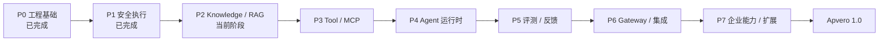
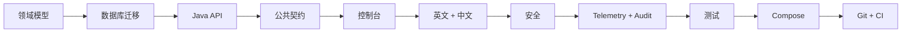

# Apvero 分阶段交付路线图

## 用途

这份路线图定义实现顺序，不承诺市场发布时间。每个阶段必须先完成一条可用的端到端闭环，下一阶段才能升级为真实功能。后续页面可以保留完整原型，但不能提前宣称服务端已经实现。

机器可读的权威文件是 [`architecture/delivery-stages.yaml`](../../architecture/delivery-stages.yaml)。

## 总流程



| 阶段 | 交付结果 | 状态 |
|---|---|---|
| P0 | 可约束的架构与可运行仓库基线 | 已完成 |
| P1 | 安全、可归因、受成本控制的模型执行 | 已完成 |
| P2 | 不可变、租户隔离、带引用的 Knowledge/RAG | 进行中 |
| P3 | 类型化、受权限控制的 Tool/MCP 执行 | 规划 |
| P4 | 有边界、可观测的 Agent Application 运行时 | 规划 |
| P5 | 以证据驱动的评测、反馈与发布门禁 | 规划 |
| P6 | 统一 Application Gateway 与可靠集成 | 规划 |
| P7 | 企业管理与隔离扩展生态 | 规划 |

## P0——工程基础与产品宪法

已经交付：

- 模块化单体边界与架构测试；
- Application → 不可变 ReleaseBundle → Run 主干；
- PostgreSQL 是默认唯一强制有状态依赖，并提供 Docker Compose；
- 已批准导航、页面清单与明确的数据模式标签；
- 英文源语言与强制完整的简体中文覆盖；
- OpenAPI、JSON Schema、ADR 与 AI 开发宪法；
- 公开 GitHub 基线与全绿 CI。

P0 已关闭。涉及其受保护决策的修改必须提交 ADR，不能非正式地重新打开阶段。

## P1——安全模型执行与治理

业务链路：

```text
Secret Reference -> Provider -> Model -> Route -> Prompt Version
-> Application Draft -> Preview -> 不可变 Release -> Run -> Usage & Cost
```

已经交付：有作用域的 API Credential、Secret Reference、版本化 Provider/模型/路由/Prompt、Application 草稿绑定、不可变预览与生产发布包、确定性与显式启用的 Spring AI 执行、调用前限流和预算准入、类型化审计、非计费就绪状态、Micrometer 指标、可配置留存/脱敏、PostgreSQL 隔离/失败验证、Run 账本以及真实用量/成本证据。

P1 已在 P2 成为当前阶段前验收关闭。其控制继续作为所有 P2 付费 Embedding 与生成调用的强制依赖。

退出条件：未认证、跨工作区、超限和超预算请求全部默认拒绝；Secret 明文不落库、不返回；每次变更和运行都具备身份、Trace、标准化结果、用量与成本证据。

## P2——Knowledge 与可信 RAG

ADR-0006 已批准。P2.0 获批的兼容规则、公开 API、Schema 与内部 Worker 基线记录在 [`p2-contract-baseline.md`](p2-contract-baseline.md)。这些 P2 契约在对应实现切片通过验证前，继续明确保持 `contract-only`。

P2.1 正在实施。P2.1a 建立物理 Knowledge 模块、默认拒绝的启用与 Health、Worker 私有部署边界，以及版本化 Parser 候选语料/决策。P2.1b 增加六张带 Scope 的摄取表、由数据库强制执行的不可变血缘，以及必须接收 Tenant/Workspace Scope 的 Repository。P2.1c 闭合 Base 与非 Web Source 的编写流程，包括不可变 Revision、排队 Job、Audit、No-op 识别、内容读取和 Tombstone。P2.1d 已交付受保护的网页 Source 调度、固定地址 SSRF 防护、有界采集、安全元数据持久化和 Changed/Unchanged 同步。P2.1e 已形成实现候选，覆盖五种格式的有界 Worker 解析/切块契约、严格的 Java 响应校验，以及不可变 Document 与 Chunk 的事务化幂等持久化。Knowledge 仍默认关闭；自动耐久任务执行、检索、产品 Live 激活及 P2 Exit Gate 仍属于后续工作。

业务链路：

```text
Source -> Ingestion Job -> Parse -> Chunk -> Embed -> Index Version
-> Retrieval Test -> Application Binding -> Release -> 带引用回答
```

第一批交付文件、网页和 Markdown 数据源；持久化且可恢复的摄取任务；确定性 Chunk；pgvector 索引；展示 Score 与来源的检索检查器；不可变索引版本；Release 固定 Knowledge；回答引用；删除和重新同步传播。

退出条件：不发布部分完成的索引；每个 Chunk 都有来源血缘和工作区范围；跨工作区检索默认失败；正式发布的 Application 能从固定索引版本生成可验证引用。

## P3——Tool 与 MCP 能力

业务链路：

```text
Register -> Schema -> Secret -> Permission -> Test -> Bind
-> Invoke -> Trace -> Audit
```

交付 HTTP Tool、只读 SQL Tool、MCP 注册与发现、JSON Schema 输入输出、方法级权限、隔离执行、超时、配额、幂等、有限重试，以及脱敏后的调用 Trace 和 Audit。

退出条件：Capability 未授权时默认拒绝；SQL 保持只读并受 Schema、行数和超时限制；输入输出经过类型校验；Secret 被脱敏；失败不能破坏父 Run，也不能悄悄执行未批准的重试。

## P4——受治理的 Agent 运行时

Agent 始终是 Application 的一种运行模式。它组合版本化的 Model Route、Prompt、Knowledge、Tool、MCP、Memory 和 Guardrail，不成为与 Application 竞争的根对象。

业务链路：

```text
Configure -> Preview -> Inspect Steps -> Evaluate -> Release -> Invoke -> Observe
```

退出条件：已发布 Agent 的固定依赖不能偷偷漂移；步骤、时间、Token、成本和重试上限全部生效；高风险操作需要明确批准；模型、检索和能力调用的每一步都可以追踪。

## P5——Evaluation、Feedback 与发布门禁

业务链路：

```text
Production Run -> Feedback -> Curated Case -> Dataset Version
-> Candidate -> Evaluation -> Comparison -> Release Gate
```

交付版本化 Dataset/Case、确定性评测、模型裁判、人工审核、回归对比、反馈转 Case、A/B 实验、不可变报告和强制发布门禁。

退出条件：候选修改必须基于版本化证据运行；质量退化能够自动阻止发布；ReleaseBundle 固定评测报告；经过审核的生产失败能够成为永久回归案例。

## P6——Gateway 与集成

业务链路：

```text
Client -> Scoped API Key -> Gateway -> Application Release -> Runtime
-> Response -> Event -> Destination
```

交付统一 Application API、幂等键、带用量记录的 SSE、受策略控制的精确/语义缓存、签名 Webhook、投递日志、重试/死信处理，以及 Java/TypeScript SDK 基线。

退出条件：客户端不需要 Provider 凭证；相同幂等请求不能重复执行或扣费；流式请求仍保留完整 Trace 与用量；失败投递可以从死信中恢复。

## P7——企业管理与扩展生态

交付 OIDC/LDAP/SCIM 适配器、细粒度策略管理、通过不可变 Release 指针进行环境晋级、经过测试的备份恢复、签名插件包、兼容性检查、进程外 Runner、Helm 指南和升级验证。

退出条件：企业身份默认拒绝且可审计；环境晋级保持 Release 身份；恢复流程经过验证；插件声明权限、通过完整性和签名检查并在控制平面外运行；文档能够完整复现自托管 1.0 闭环。

## 每个阶段统一门禁



只有页面或 CRUD 不代表阶段完成。每个阶段必须同时具备安全持久化、公共契约、授权、租户隔离、可观测性、双语 UI/文档、成功与失败测试、可复现 Compose 链路、回滚或缓解措施，以及全绿 CI。

## 变更控制

- `architecture/delivery-stages.yaml` 是阶段和状态的唯一机器可读真相。
- 英文与简体中文路线图必须在同一个提交中修改。
- 维护者根据退出证据批准阶段切换。
- 后续阶段原型继续标注为 `demo`、`planned` 或 `contract-only`。
- 任何受保护边界变更仍然执行 ADR 流程。
